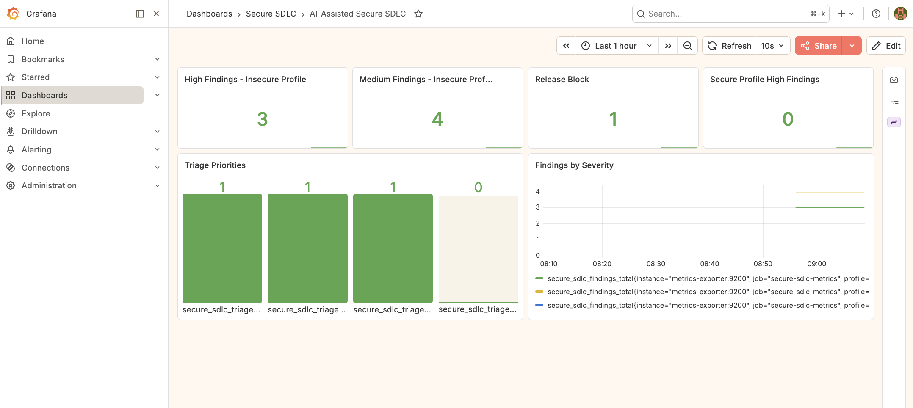
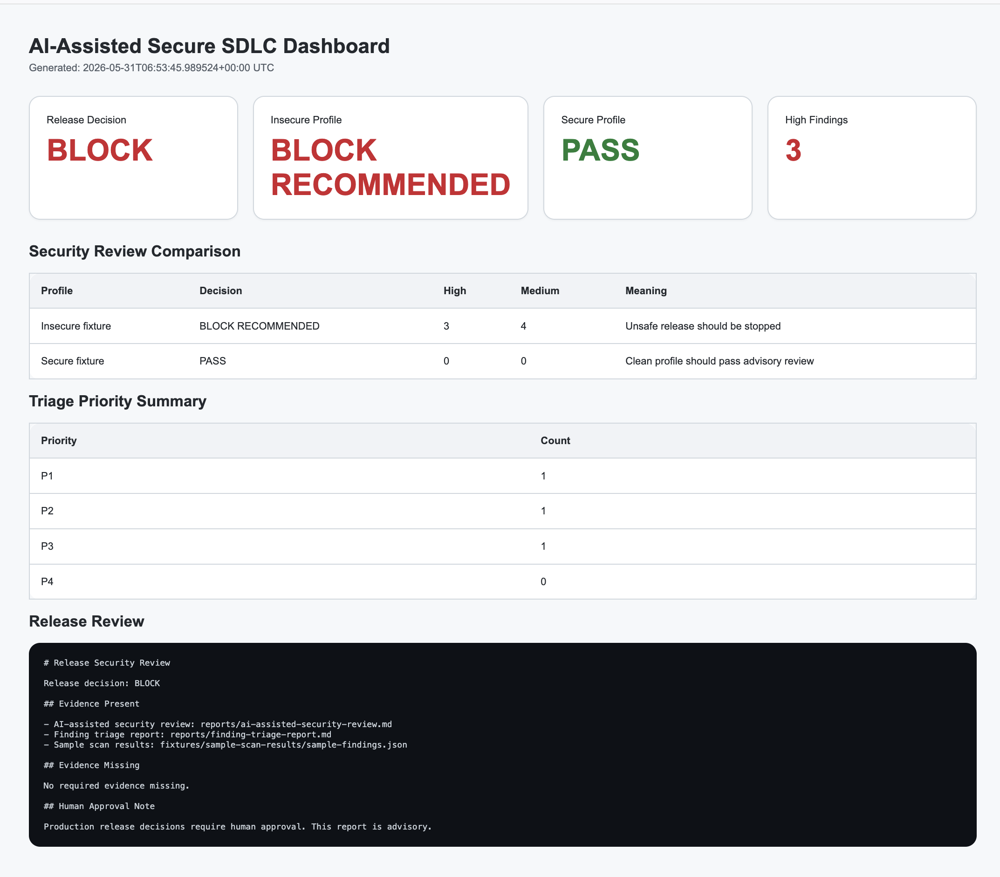
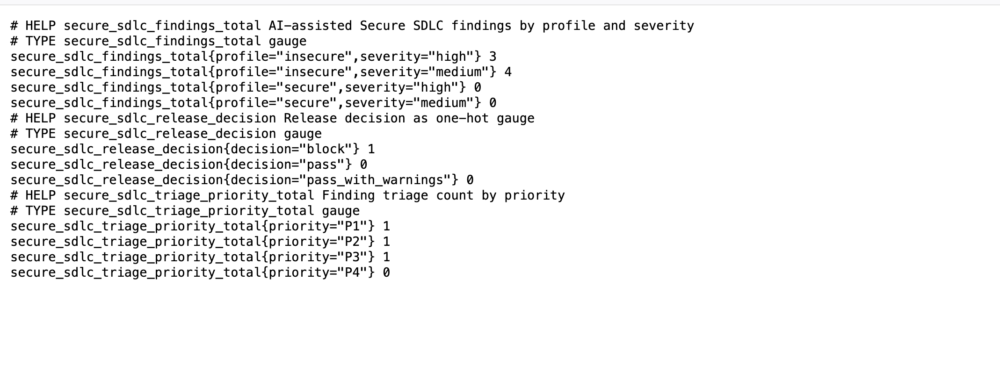
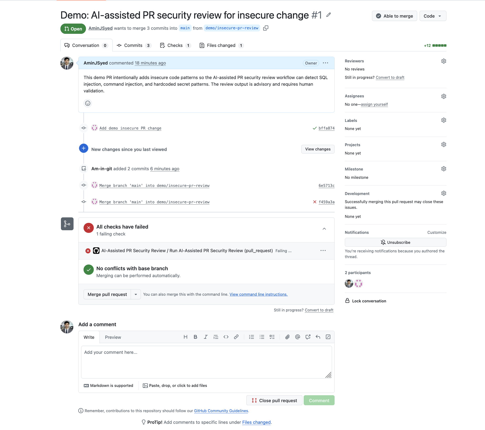
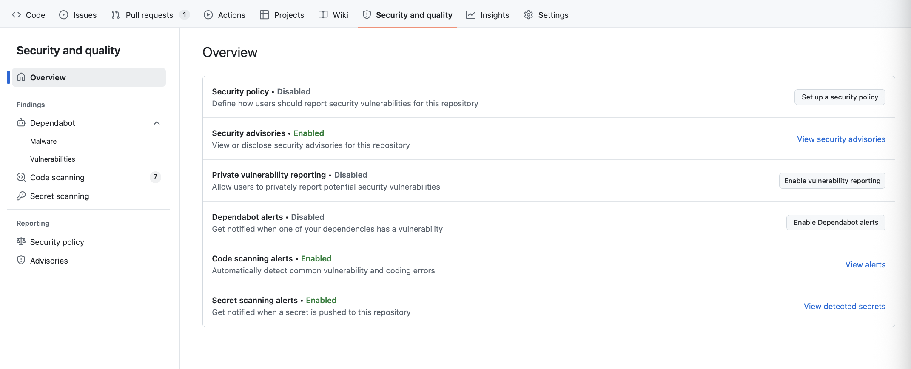
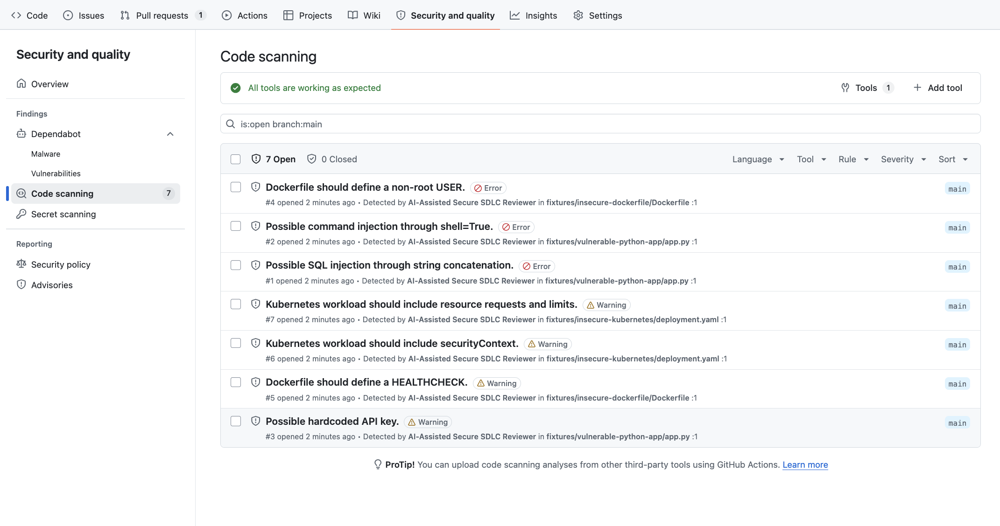

# AI-Assisted Secure SDLC

AI-assisted security review, vulnerability triage, and release readiness automation for secure software delivery.

## Purpose

This project demonstrates how AI-assisted engineering can support Secure SDLC workflows.

It focuses on using automation and AI-style review logic to support:

- pull request security review
- secure code review
- vulnerability triage
- release readiness checks
- secure software release management
- security evidence generation
- human approval gates

This project does not replace human review.

The goal is to support security engineers, developers, and release managers with structured security decision support.

## What This Project Demonstrates

This project demonstrates:

- AI-assisted PR security review
- AI-assisted secure code review
- AI-assisted vulnerability triage
- AI-assisted release readiness review
- AI-assisted security evidence generation
- Secure SDLC workflow automation
- advisory security gates
- human approval policy for high-risk changes

## Platform Capabilities

This project acts as a compact AI-assisted Secure SDLC platform.

It provides:

| Capability | What It Does |
|---|---|
| PR security review | Reviews changed files in pull requests and identifies risky code or configuration |
| Security gate enforcement | Fails the PR workflow when the review decision is `BLOCK RECOMMENDED` |
| Secure code review | Detects patterns such as SQL injection, command injection, hardcoded secrets, and missing hardening controls |
| Vulnerability triage | Prioritizes findings using severity, runtime exposure, and fix availability |
| Release readiness review | Produces release decisions such as PASS, PASS WITH WARNINGS, or BLOCK |
| Security intelligence | Generates SARIF, AI-assisted remediation guidance, risk score, and executive release summary |
| Code scanning integration | Uploads SARIF findings into GitHub Code Scanning |
| Dashboarding | Publishes HTML, Prometheus, and Grafana views for security posture |
| Governance | Adds release policy, CODEOWNERS, evidence index, and branch protection guidance |
| Human approval model | Keeps AI-assisted output advisory and requires human validation for high-risk decisions |

## Production-Style Workflow

The intended workflow is:

    developer opens PR
    -> AI-assisted PR review scans changed files
    -> risky patterns are identified
    -> PR receives a security review comment
    -> workflow artifact is uploaded
    -> security gate fails if BLOCK RECOMMENDED
    -> release review generates evidence
    -> SARIF findings appear in GitHub Code Scanning
    -> dashboards visualize release/security posture
    -> human reviewer approves, rejects, or accepts risk

## Current Design

The first version uses a local rule-based AI-style reviewer.

This avoids the need for a real LLM API key and makes the project safe to run in CI/CD.

Future versions can optionally integrate with an LLM provider through a protected secret.

## Secure SDLC Flow

| Stage | AI-Assisted Activity |
|---|---|
| Planning | Identify security requirements and approval needs |
| Development | Review code patterns, secrets, dependencies, and configs |
| Pull Request | Generate AI-assisted security review summary |
| Build | Check SAST, SCA, container, and IaC evidence |
| Release | Generate release readiness decision |
| Production Readiness | Require human approval for risky changes |
| Evidence | Produce markdown security evidence and review reports |

## Project Structure

    ai-assisted-secure-sdlc/
    |
    |-- README.md
    |-- Makefile
    |
    |-- ai-reviewer/
    |   |-- review_changed_files.py
    |   |-- release_security_review.py
    |   |-- finding_triage_assistant.py
    |
    |-- docs/
    |   |-- ai-assisted-secure-sdlc-model.md
    |   |-- ai-pr-review-policy.md
    |   |-- secure-release-review-model.md
    |   |-- human-approval-policy.md
    |
    |-- fixtures/
    |   |-- vulnerable-python-app/
    |   |-- insecure-dockerfile/
    |   |-- insecure-kubernetes/
    |   |-- sample-scan-results/
    |
    |-- reports/
    |
    |-- evidence/
    |   |-- ai-assisted-secure-sdlc-summary.md
    |
    |-- .github/workflows/
    |   |-- ai-assisted-pr-review.yml
    |   |-- release-security-review.yml

## Main Commands

Show available commands:

    make help

Run AI-assisted PR security review:

    make ai-review

Run release security review:

    make release-review

Run finding triage assistant:

    make triage

Run all local reviews:

    make all

## Output Reports

Generated reports are written to:

    reports/

Important reports:

| Report | Purpose |
|---|---|
| ai-assisted-security-review.md | PR/code security review summary |
| release-security-review.md | Release readiness security decision |
| finding-triage-report.md | Vulnerability triage and prioritization summary |

## Security Philosophy

AI-assisted security should support human reviewers, not bypass them.

This project follows these principles:

- AI output is advisory
- high-risk changes require human approval
- secrets must never be exposed to AI prompts
- generated code must be scanned and reviewed
- security gates must be explainable
- release decisions should be evidence-based
- automation should not approve its own risky changes

## Dashboards and Visual Evidence

This project includes visual dashboards to make AI-assisted Secure SDLC decisions easier to understand.

The dashboarding layer shows how insecure code and configuration can result in a blocked release decision, while secure fixtures pass the advisory review.

| Dashboard | Purpose |
|---|---|
|  | Grafana dashboard showing high findings, medium findings, release block status, secure profile status, and triage priorities |
|  | Static HTML dashboard generated from AI-assisted security review and release review outputs |
|  | Prometheus metrics exposed for Secure SDLC findings, release decision, and triage priorities |
|  | Pull request blocked by the AI-assisted PR security review after detecting risky code patterns |
|  | GitHub Security and quality overview showing code scanning and secret scanning enabled |
|  | AI-assisted SARIF findings visible in GitHub Code Scanning alerts |

### Observability Flow

The project generates security review reports, converts them into Prometheus-style metrics, and visualizes them in Grafana.

    AI-assisted review -> release review -> metrics exporter -> Prometheus -> Grafana

This makes the Secure SDLC decision process visible through both reports and dashboards.

## PR Security Gate Behavior

The AI-Assisted PR Security Review workflow is designed to behave like a Secure SDLC advisory gate.

For pull requests, it:

- detects changed files
- scans the changed files for risky code and configuration patterns
- generates a markdown security review
- comments the review summary on the pull request
- uploads the review as a GitHub Actions artifact
- fails the check if the decision is `BLOCK RECOMMENDED`

This makes insecure pull requests visible directly in GitHub and prevents risky changes from appearing as fully green without review.

## Pull Request Demo Flow

This project includes a demo flow to show AI-assisted PR security review in action.

Create a demo insecure PR branch:

    make demo-pr

Push the branch:

    git push -u origin demo/insecure-pr-review

Then open a pull request into `main`.

The AI-Assisted PR Security Review workflow will:

- detect changed files
- scan the PR changes
- identify risky patterns
- generate a security review report
- upload the review as a GitHub Actions artifact

The demo PR intentionally includes insecure patterns so the review should recommend blocking or human review.

This demonstrates how AI-assisted security automation can support PR review without automatically approving risky changes.

## Optional AI Provider Integration

This project supports optional AI provider integration while keeping the default workflow safe and deterministic.

| Provider Mode | Purpose |
|---|---|
| rule_based | Default local mode used in CI/CD. No external AI API required |
| mock | Simulates LLM-style review and remediation output without external calls |
| external | Optional integration with an approved external AI gateway using secrets |

Run AI-assisted remediation locally:

    make ai-remediation

Run with mock provider mode:

    AI_PROVIDER=mock make ai-remediation

External provider mode requires these environment variables:

    AI_PROVIDER=external
    AI_API_URL=<approved-ai-gateway-url>
    AI_API_KEY=<stored-securely>

No real API key or production secret should be committed to this repository.

## Governance Layer

This project includes a governance layer for production-style Secure SDLC control.

| File | Purpose |
|---|---|
| policy/release-policy.yml | Policy-as-code release decision and approval model |
| .github/CODEOWNERS | Ownership rules for sensitive project paths |
| docs/branch-protection-policy.md | Recommended branch protection and required checks |
| docs/governance-model.md | Governance model for AI-assisted Secure SDLC |
| evidence/evidence-index.md | Index of generated reports, dashboards, screenshots, and security evidence |

The governance layer ensures that AI-assisted automation supports decision-making without bypassing human accountability.

## Security Intelligence Layer

This project includes a Security Intelligence Layer that converts AI-assisted review output into structured security evidence.

It generates:

- SARIF output for GitHub Code Scanning
- AI-assisted remediation suggestions
- security risk score
- executive release security summary

Run locally:

    make security-intelligence

Generated files:

| File | Purpose |
|---|---|
| reports/ai-assisted-findings.sarif | Code scanning compatible SARIF output |
| reports/security-risk-score.md | Risk score and recommended decision |
| reports/executive-release-summary.md | Executive release security summary |

This makes the Secure SDLC workflow easier to consume by developers, security engineers, and release managers.

## Dashboarding and Observability

This project includes dashboarding for AI-assisted Secure SDLC visibility.

It can generate:

- markdown reports
- HTML dashboard
- Prometheus metrics
- Grafana dashboard

Generate local dashboard:

    make dashboard

Start Prometheus and Grafana:

    make monitoring

Open Grafana:

    http://localhost:3002

Open Prometheus:

    http://localhost:9091

Open metrics endpoint:

    http://localhost:9200/metrics

